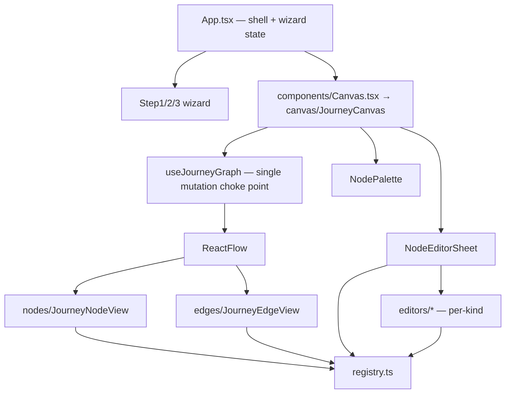

# Journey Builder — Engineering Spec

**Status:** prototype (front-end complete, mock data layer)
**Stack:** Vite + React 18 + TypeScript + [React Flow](https://reactflow.dev) v11 + dagre
**Live:** https://appstorys-journey-setup.vercel.app · **Repo:** `appstorys-journey-builder`

This document is the hand-off for engineering: architecture, the node model, the
extension points, and every place a mock needs to become a real API. It reflects
the code as built — file paths and symbol names are exact.

---

## 1. What it is

A two-part flow for creating an in-app **journey**:

1. **Setup wizard** (3 steps) — trigger/audience, entry/exit, goals → produces the
   trigger + audience config.
2. **Flow canvas** — an n8n-style, free-form, top-down graph editor where the
   journey's steps (campaigns, messages, conditions, splits, delays, data ops)
   are placed, connected, and configured.

The setup wizard's trigger config surfaces on the canvas as an **entry badge** on
the first node. There are **no Start/End nodes** — entry is the node with no
incoming edge; a node with no outgoing edge on a port is terminal (dot cap).

---

## 2. Architecture



- **Single source of truth for the graph** is `useJourneyGraph`. Components never
  call `setNodes`/`setEdges` — every mutation is a named action, so undo/redo and
  validation have one choke point.
- **The registry (`canvas/registry.ts`) drives everything data-first.** Node
  rendering, palette, minimap tint, card content, validation and branching are
  all pure functions keyed by `NodeKind`. Adding a node kind is a registry edit,
  not new components.

### Directory map

```
src/
  App.tsx                 shell: nav, topbar, stepper, footer, toast; owns wizard state
  types.ts                wizard model (Goal, EventCondition, TriggerType, AudienceMode…)
  index.css               design system (component classes) + all canvas/component CSS
  main.tsx                React root
  vite-env.d.ts

  components/
    ui.tsx                Radio, RadioRail, Toggle, ToggleRow, PillGroup, TimeGroup,
                          TimezoneSelect, RolloutBar, Tooltip, Card
    Step1Details.tsx      details + conversion goals
    Step2Trigger.tsx      entry trigger variants (event / fixed / exit)
    Step3Audience.tsx     audience (all / segments / rules) + estimated reach
    EventPicker.tsx       searchable, category-grouped event combobox
    EventFilters.tsx      attribute filters on a selected event (legacy; Step 2 uses it)
    SegmentSelect.tsx     active-cohort droplist
    CampaignPicker.tsx    import-existing / create-new campaign panel
    ConditionBuilder.tsx  Event/Attribute condition builder (used in condition nodes)

  data/
    events.ts             EVENT_CATALOG (+ per-event attributes), EventFilter, attrOperators
    campaigns.ts          CAMPAIGNS mock (id, name, date, status)
  hooks/
    useSegments.ts        active cohorts (mock; filters status === 'active')

  canvas/
    JourneyCanvas.tsx     engine wiring, bottom toolbar, minimap, keyboard, DnD,
                          palette + sheet orchestration, publish validation
    useJourneyGraph.ts    graph state, named actions, undo/redo (choke point)
    registry.ts           NODE_TYPES, families, makeDefaultConfig, cardRows, validity,
                          branchesFor, summarize
    types.ts              NodeKind, NodeFamily, ConfigByKind, JourneyNode/Edge, Condition,
                          CardRow, Branch, Validity, GraphSnapshot
    icons.tsx             per-kind glyphs
    context.ts            CanvasContext (entry id, badge, node/edge action callbacks)
    layout.ts             dagre top-down "Tidy up"
    NodePalette.tsx       two-pane "Add to journey" modal
    NodeEditorSheet.tsx   right-side editor sheet + live preview + status pill
    editors/index.tsx     NODE_EDITORS: exhaustive per-kind editor registry
    editors/env.ts        EditorEnvContext (node list for the Jump target picker)
    nodes/JourneyNodeView.tsx   custom node card
    edges/JourneyEdgeView.tsx   custom edge (orthogonal, branch labels, hover flow, insert +)
    edges/edgeDnd.ts            drop-target-edge context
```

---

## 3. The node model

**29 node kinds across 10 families.** `NodeKind` is a string-literal union in
`canvas/types.ts`; `NODE_TYPES` in `registry.ts` is the catalog.

| Family (`NodeFamily`) | Palette label | Kinds |
|---|---|---|
| `campaign` | Campaigns | animations, bottomsheet, carousel, spotlight, floater, gamification, modal, pagepop, pinnedbanner, tooltip, video, widgets |
| `message` | Messages | push, whatsapp, email, sms |
| `action` | Action conditions | msg_seen, msg_clicked, msg_closed |
| `ai` | AI tools | path_optimizer |
| `usercond` | User conditions | check_attr, has_done_event |
| `branching` | Split user path | cond (Conditional Split), randomsplit (A/B Split) |
| `experiment` | Experiments | abtest (A/B Test) |
| `delay` | Delay | delay |
| `data` | Data | setattr, segment |
| `flow` | Flow control | jump |

### Per-kind config

`ConfigByKind` (in `canvas/types.ts`) maps each kind to its typed config shape.
`JourneyNodeConfig = ConfigByKind[NodeKind]`. A node is
`JourneyNode = Node<JourneyNodeData, 'journey'>` where
`JourneyNodeData = { kind: NodeKind; title: string; meta: string; config: JourneyNodeConfig }`.
Position lives on `node.position` (React Flow) and is the persisted spatial layout.

Campaign kinds share `CampaignBase` (`{ source, campaignId, campaignName }`) + a
few type-specific fields. Branching/experiment kinds carry arms/variants and
labels. Condition kinds carry `Condition[]` (see §6).

### The card-data contract (four pure functions per kind)

Everything a kind needs is declared in `registry.ts`. All are exhaustive
`switch (kind)` blocks — a new kind that misses a case is a **compile error**.

- `cardRows(kind, config): CardRow[]` — up to 3 tone-aware key→value rows shown
  on the canvas card. Replaces a flat summary string.
- `validity(kind, config): { ok: true } | { ok: false; msg }` — drives the red
  "!" needs-setup badge and the editor status pill.
- `branchesFor(kind, config): Branch[]` — output ports (Condition → yes/no,
  A/B → variant arms, others → single implicit port). Drives handles + on-edge
  labels.
- `summarize(kind, config): string` — stored `node.data.meta`.

### Adding a new node kind (checklist)

1. `canvas/types.ts` — add the literal to `NodeKind`; add its shape to `ConfigByKind`.
2. `canvas/registry.ts` — add a `NODE_TYPES` entry (label, family, color,
   description, default title), a `makeDefaultConfig` case, and `cardRows` /
   `validity` / `branchesFor` / `summarize` cases.
3. `canvas/icons.tsx` — one glyph.
4. `canvas/editors/index.tsx` — one `EditorFor<K>` registered in `NODE_EDITORS`.
5. If it's a new family: add color/label to `FAMILY_COLOR`/`FAMILY_LABEL`,
   include it in `FAMILY_ORDER`, and add a rail glyph in `NodePalette`.

The exhaustive `Record<NodeKind, …>` maps and `switch` guards make every missing
piece fail `tsc` — you cannot ship a half-wired kind.

---

## 4. Graph state & undo/redo (`useJourneyGraph`)

State is one object `{ nodes, edges, entryId }`. A `ref` mirrors it for reads
inside event handlers. Named actions:

`addNode · addNodeWithConnection · insertOnEdge · connect · reconnect ·
detachEdge · deleteSelection · deleteNode · duplicateSelection · duplicateNode ·
nudgeSelection · selectAll · clearSelection · updateNodeData · setLayout · undo · redo`

- **History:** bounded past/future stacks of `GraphSnapshot` (max 50). Named
  mutations `pushHistory()` first; React Flow's transient changes
  (`onNodesChange`/`onEdgesChange`) do **not** — a drag snapshots once on
  `onNodeDragStart`. Continuous ops (arrow-nudge) coalesce.
- **Validation on connect** (`isValidConnection`): rejects self-loops, edges into
  the entry node, duplicates, and cycles; the UI explains why via a toast.

---

## 5. Canvas interactions (`JourneyCanvas`)

- **Free-form, top-down tree.** Nodes draggable anywhere; target handle on top,
  source handle(s) on the bottom. Orthogonal (smooth-step) edges.
- **Connect:** drag from a source port to a target port; drop on empty canvas
  opens the palette and creates node + edge in one action; reconnect by grabbing
  an edge end; drop on empty detaches (undo-able).
- **Insert-on-edge:** hover an edge → a subtle "+" at the midpoint → palette →
  node inserted inline with rewiring. Palette rows can also be dragged onto an
  edge to insert.
- **Edge visuals:** connector `#F0AA7B`; hover shows brand-orange flowing packets
  and thickens; selection turns brand. On-edge pills carry branch labels (Yes/No,
  variant %).
- **Pan/zoom:** space/middle-drag + trackpad pan, ⌘/Ctrl-scroll + pinch zoom,
  fit-view on load. Bottom-center toolbar: zoom/fit/snap(22px)/tidy-up/undo-redo/?.
  Restyled minimap bottom-right (tinted by family color).
- **Keyboard:** Delete/Backspace, ⌘D duplicate, ⌘Z / ⇧⌘Z undo-redo, ⌘A select-all,
  Esc, arrow-nudge (⇧ = 5 grid units). All shortcuts in the "?" popover.
- **Tidy up:** dagre top-down layered layout (`layout.ts`), animated.

---

## 6. Reusable selection components

- **`EventPicker`** — searchable, category-grouped event combobox. Value =
  event name. Source: `EVENT_CATALOG`.
- **`ConditionBuilder`** — the Event/Attribute filter (per the reference): a list
  of `Condition` cards, each with an Event/Attribute tab. Event mode = verb /
  event / count-operator / count "times in the last" period+unit + indented
  event-property rows; Attribute mode = attribute / operator / value.
  Embedded in the three condition nodes: `cond`, `check_attr`, `has_done_event`
  (each config is `{ conditions: Condition[] }`; check_attr defaults to Attribute).
- **`SegmentSelect`** — droplist of **active** cohorts only (`useSegments`
  filters `status === 'active'`); empty-state links out to the Cohorts flow.
- **`CampaignPicker`** — import-existing (search + selectable rows with status
  pill + check) / create-new banner. Used by all 12 campaign editors via
  `CampaignSource(typeName)`.

---

## 7. Editor sheet (`NodeEditorSheet`)

Opens on node double-click or the node toolbar's Edit. Keyed by `node.id` so it
remounts per node (no stale drafts). Header: kind icon + editable title +
**READY / NEEDS SETUP** pill from `validity(draft)`. A live **"On the card"
preview** renders `cardRows`/`branchesFor`/`validity` against the draft. Body =
the kind's `EditorFor<K>`. Footer: Cancel / Save (dirty-gated); closing dirty
shows a Discard/Keep-editing guard. Save writes via `updateNodeData`; the card
updates live.

---

## 8. Validation & publish

`tryPublish` in `JourneyCanvas` blocks publish when: 0 nodes; the event trigger
has no event selected; or any node has an **orphaned branch** (a branch port with
no outgoing edge). Per-node readiness is `validity(kind, config)`.

---

## 9. API integration seams (all currently mock)

Everything below is a swap-in point — the UI contracts are stable.

| Area | Mock | Replace with |
|---|---|---|
| Events + attributes | `data/events.ts` (`EVENT_CATALOG`, per-event `attributes`) | Events API. `EventPicker`/`ConditionBuilder` read from it. |
| Campaigns | `data/campaigns.ts` (`CAMPAIGNS`) | Campaigns API (list/search). `CampaignPicker` reads it. |
| Segments/cohorts | `hooks/useSegments.ts` | Cohorts API; keep the active-only filter server-side. |
| Estimated reach | formula in `Step3Audience` | segment-count endpoint. |
| Save draft / Publish | toast only (`JourneyCanvas`) | persist the graph (see §10) + publish endpoint. |
| Node "Send test" / campaign "Edit content" | toast / `window.open` stub | test-send API / deep-link into the campaign builder with `returnTo=journey-builder`. |
| Jump target picker | `EditorEnvContext` (in-graph nodes) | fine as-is; no API. |

**Contracts to preserve:** `EventPicker` props mirror the (WIP) cohorts filter;
`ConditionBuilder` is self-contained on `Condition[]`; `SegmentSelect` takes
`selectedIds` + `onChange`. Design can replace any of these behind the same props.

---

## 10. Persistence / serialization

The graph is JSON-serializable: `GraphSnapshot = { nodes: JourneyNode[]; edges:
JourneyEdge[]; entryId: string | null }`. That, plus the wizard's trigger/audience
state (in `App.tsx`), is the full journey payload. There is **no persistence
layer yet** — Save/Publish are stubs. Recommended: serialize `GraphSnapshot` +
wizard state to the journey record; hydrate by seeding `useJourneyGraph`'s
initial state (add a `replaceGraph`/initializer — currently it starts empty).

---

## 11. Build, deploy, conventions

- `npm run typecheck` (`tsc --noEmit`) and `npm run build` must both pass. No `any`;
  strict mode on. Exhaustive `switch`/`Record<NodeKind,…>` are the safety net.
- Design system lives in `src/index.css` as component classes (brand `#FB6514`,
  gradient, cream states, Poppins). Do not hardcode off-token colors.
- Deployed on Vercel (Vite preset → `dist`). Every push builds via
  `tsc --noEmit && vite build`.

---

## 12. Known limitations & roadmap

- **React Flow is rAF-gated** — it renders blank in a hidden/background tab
  (measurement + zoom pause). Only affects headless/automated previews; real
  users are unaffected. Relevant for any automated screenshot testing.
- **Campaign picker** lives in the editor sheet (works, but narrow). The
  reference shows a two-step palette flow ("Add to journey → pick type → import");
  not yet wired.
- **ConditionBuilder** covers the three condition nodes. The wizard surfaces
  (Step 2 trigger, exit conditions, Step 1 goal) still use `EventPicker` +
  `EventFilters`; migrate if the unified builder is wanted there too.
- **No Exit terminal nodes** — terminal is shown as a subtle port cap, per the
  original "no Start/End" decision. Add explicit Exit nodes if desired.
- **Simulate mode** — edge classes exist (`.canvas-shell.simulate`) for animated
  flow during simulation; the simulate button/data are not wired.
- **A/B Test** (`abtest`) is a scaffold: variants + goal + auto-winner in config;
  no results/uplift computation.
